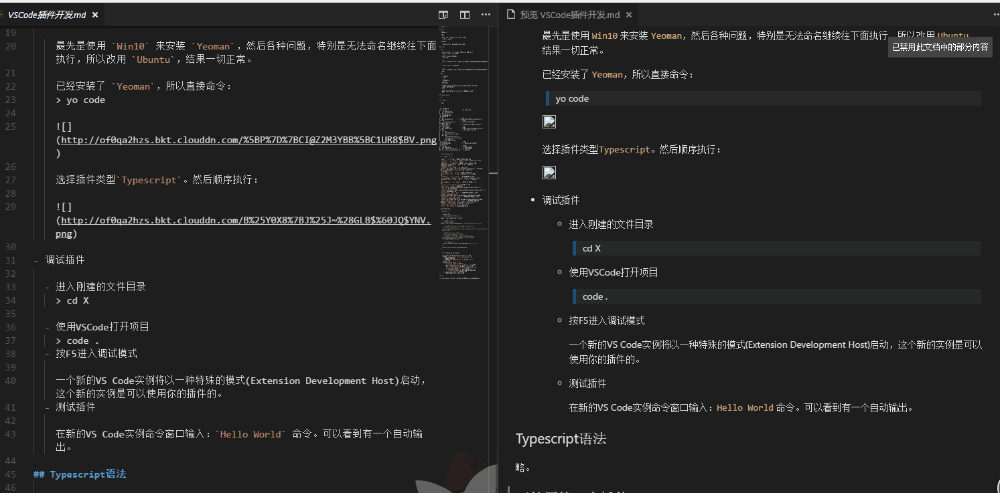

# Chaos

Chaos is a vscode plugin to add markdown grammer `` for your english words in markdown.

Idea come from [pangu.js](https://github.com/vinta/pangu.js)

`Chaos` 是一款帮助我们在 `markdown` 文章中给英文添加``标签的插件。

想法来自于 `盘古之白`，不过我不仅希望有空格，更希望 `markdown`里面的英文都有``标签而不需要自己每次手动添加（很累）。

## Example

## Features

Add chaos for your selection.

## Commands

- Chaos: Add chaos for selection

## Known Issues

- You can report issues here [Github issues]()

## Release Notes

### 0.0.1

- Add chaos for your selection

## License

Released under the [MIT License](https://opensource.org/licenses/MIT).

## Thanks

Thanks vinta for his [pangu.js](https://github.com/vinta/pangu.js).

**Enjoy!**